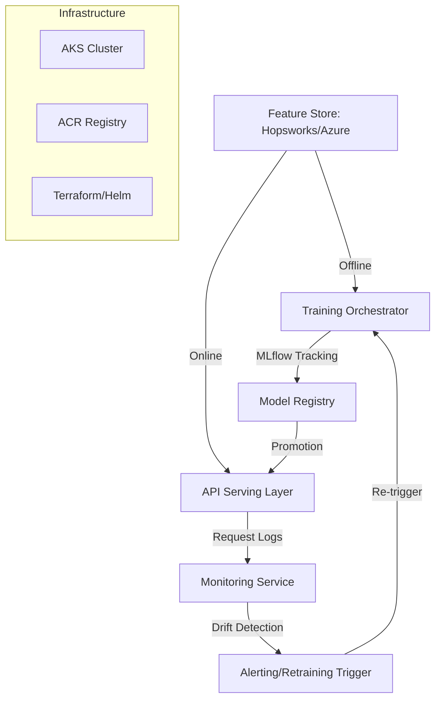

# Enterprise MLOps Production Suite: Robust Lifecycle Engine

An enterprise-grade MLOps engine designed for high-scale, production-ready machine learning workflows. This repository provides a unified framework for feature management, automated training, experiment tracking, and robust monitoring.

## 🚀 Technical Architecture



## ✨ Key Features

- **Drift Detection:** Advanced statistical tests (KS-test, PSI) and Evidently AI integration for data/model drift monitoring.
- **Feature Store Interface:** Modular connectivity to Hopsworks and Azure ML Feature Store.
- **Training Orchestrator:** Seamless experiment tracking with MLflow and automated model promotion to Production.
- **Infrastructure-as-Code (IaC):** Ready-to-use Terraform scripts for AKS/ACR and professional Helm charts for K8s deployment.
- **CI/CD Excellence:** Detailed Azure DevOps pipelines for multi-stage (Dev/Prod) deployments.

## 📈 MLOps Maturity Model

This repository is designed to move your organization from **Level 0 (Manual Process)** to **Level 2 (Automated CI/CD and Monitoring)**:

- **Level 0:** Manual script execution (Not supported).
- **Level 1:** Automated training pipelines and experiment tracking (Supported by `src/training/orchestrator.py`).
- **Level 2:** CI/CD for ML models and robust production monitoring (Supported by `scripts/azure-pipelines.yml` and `src/monitoring/drift_detector.py`).

## 🛠️ Production Deployment Guide

### 1. Provision Infrastructure
Navigate to `infrastructure/terraform` and execute:
```bash
terraform init
terraform plan
terraform apply
```

### 2. Configure Helm Chart
Update `infrastructure/helm/chart/values.yaml` with your ACR details and environment variables.

### 3. CI/CD Pipeline Setup
1. Import `scripts/azure-pipelines.yml` into your Azure DevOps project.
2. Configure **Service Connections** for:
   - Azure Resource Manager (`Azure-MLOps-Service-Connection`)
   - Azure Container Registry (`AzureMLOpsConnection`)
3. Run the pipeline to build, test, and deploy to AKS.

## 💻 Core Components

- **`src/monitoring/drift_detector.py`**: Implementation of KS-tests and Population Stability Index.
- **`src/feature_store/interface.py`**: Unified interface for external feature stores.
- **`src/training/orchestrator.py`**: MLflow-driven training and registry management.

## 📋 Requirements
- Python 3.9+
- MLflow
- scipy, evidently, azure-ai-ml
- Azure Subscription (for AKS/ACR)

---
*Maintained by Senior Research Engineering Team.*
